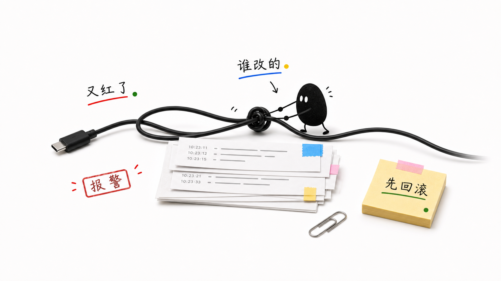
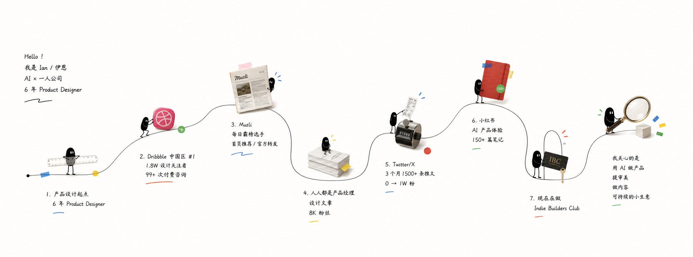

# 房语小黑角色场景 Skill

`fangyu-xiaohei-character` 是一套面向中文内容创作的 Xiaohei 2.0 视觉 Skill。

它把文章、观点、项目复盘、活动流程和个人经历，转译成：

> 小黑角色 + 真实物件 + 物理动作 + 短中文标签 + 留白叙事

这套 Skill 的核心不是“画一个可爱小人”，而是让小黑认真地参与一个真实、荒诞、读者能够立刻共情的现场。

## 视觉预览

### 标准场景：一个物件，一个动作，一个处境




这些画面使用真实物件承载抽象问题，让读者先看到一个具体现场，再理解背后的情绪和观点。

### 彩色角色：同一个小黑，不同的语义颜色


颜色只改变小黑的身体颜色，不改变头身比例、眼睛、四肢、表情或动作逻辑。颜色由内容语义决定：小红表达风险和冲突，小绿表达修复和恢复，小蓝表达系统和工具，小黄表达机会和启动。

### 长卷故事：把经历变成一条真实物件人生线



长卷模式适合项目复盘、产品演化、活动流程和个人成长。它使用曲线路径、真实物件节点和逐段参与的小黑，让多个阶段形成一张完整的视觉叙事图。

## 适合做什么

- 中文文章、公众号配图和社交媒体正文图
- AI、程序员、产品经理和创作者的工作处境
- 会议、消息过载、返工、审查、筛选、自动化和岗位变化
- 项目复盘、产品演化、个人成长和内容资产沉淀
- 活动预热、启动、点亮、机会提醒和大会流程
- 股市大涨、大跌、风险、修复和情绪变化
- 超横版的“小黑长卷故事图”

## 两种画面模式

### 标准正文图

默认输出 16:9 横版配图。画面通常包含一个真实主物件、一个核心物理动作、一个小黑角色和 2-4 个短中文标签。

适合表达一个明确的处境，例如：

- 小黑被会议日历拖回电脑
- 小黑用纸板挡住不断涌来的消息
- 小黑在放大镜下返工一份文件
- 小黑把简历推向一个正在筛选的漏斗

### 彩蛋长卷图

当内容包含项目过程、个人经历、产品演化或成长路径时，使用超横版长卷模式。

画面采用高级近白背景、一条自然弯曲的路线、5-8 个真实物件节点，以及贯穿节点的小黑动作。它不是 PPT 时间轴，也不是流程框，而是一条带有记忆点的“真实物件人生线”。

## 房语彩色小黑系统

彩色小黑不是一组新吉祥物，而是同一个小黑的身体颜色变体。

| 角色 | 语义 | 常见场景 |
| --- | --- | --- |
| 小黑 | 默认主叙事 | 职场荒诞、项目复盘、复杂故事主线 |
| 小红 | 警报、冲突、情绪高点 | 商战、风险、爆点、中国股市红涨 |
| 小绿 | 修复、恢复、通过 | 修复、连接、中国股市绿跌、回落 |
| 小蓝 | 系统、工具、数据 | 代码、AI 工作流、自动化、理性分析 |
| 小黄 | 机会、提醒、启动 | 活动预热、点亮、报名、灵感和下一步 |

颜色由内容语义触发，而不是为了装饰画面。标准 16:9 默认使用 1 个角色，最多 2 个；长卷中可按关键节点使用颜色，但不会机械地为每个节点换色。

## 角色固定规则

无论使用黑色、红色、绿色、蓝色还是黄色，小黑都必须保持同一套识别系统：

- 大而近圆的头部与较小的身体
- 清楚的头身关系
- 两个醒目的白色椭圆眼睛和小黑色瞳孔
- 短小、清楚、可以抓握真实物件的四肢
- 空、呆、冷静、认真的表情
- 哑光、低饱和、略带手绘质感的身体
- 不穿复杂服装，不戴帽子，不靠配饰区分角色

小黑必须和物件发生真实动作：推、拉、拧、抬、绑、修、贴、夹、扛、钻入或拖出。它不能只是站在画面里解释主题。

## 使用方式

将本目录作为 Skill 安装到 Codex 的 Skills 目录后，可以使用 `$fangyu-xiaohei-character` 调用。

示例：

```text
使用 $fangyu-xiaohei-character，把这段关于 AI 竞争的文章做成 4 张 16:9 正文配图。根据语义判断是否使用小红和小蓝。
```

```text
使用 $fangyu-xiaohei-character，把这个项目复盘做成一张彩蛋长卷故事图，保留 6 个关键节点，并让冲突节点使用小红、系统节点使用小蓝、收束节点使用小绿。
```

```text
使用 $fangyu-xiaohei-character，把“活动预热到大会闭幕”的过程做成一张长卷，启动和点亮节点使用小黄，正式大会以小黑为主，资源协同节点使用小绿。
```

## 工作流程

1. 从输入内容提炼读者处境、核心冲突和真实动作。
2. 锚定用户提供的事实，不擅自补写人名、品牌、时间和数字。
3. 判断标准正文图或彩蛋长卷图。
4. 根据语言场景、情绪状态和行动功能选择小黑颜色。
5. 选择最接近的质量母版，并重新设计物件、动作和标签。
6. 生成提示词或图像，并检查动作、角色、文字、留白和事实一致性。

## 目录结构

```text
fangyu-xiaohei-character/
├── SKILL.md                         # Skill 主规则
├── agents/openai.yaml                # Codex 界面元数据
├── references/
│   ├── xiaohei-character-lock.md     # 唯一角色形象标准
│   ├── color-characters.md           # 彩色角色语义与路由
│   ├── style-dna.md                  # 2.0 视觉 DNA
│   ├── prompt-template.md             # 生图提示词模板
│   ├── story-extraction.md            # 内容提炼方法
│   ├── object-patterns.md             # 真实物件选择规则
│   ├── master-selection.md            # 母版选择规则
│   └── qa-checklist.md                # 质量检查清单
└── assets/examples/                  # 标准图与长卷质量母版
```

## 设计原则

- 先理解处境，再选择物件和颜色。
- 颜色表达语义，不承担装饰任务。
- 小黑必须做事，不能只摆拍或举牌。
- 真实物件承载隐喻，短标签只做最后确认。
- 保持留白、轻盈和 3 秒读懂。
- 母版只提供质量标准，不复制具体内容和布局。

## 许可与使用

本仓库包含 Skill 规则、参考文档和示例素材。使用时请遵守仓库中的 [LICENSE](LICENSE) 与 [NOTICE.md](NOTICE.md) 说明。

角色固定说明见 [`references/xiaohei-character-lock.md`](references/xiaohei-character-lock.md)。
